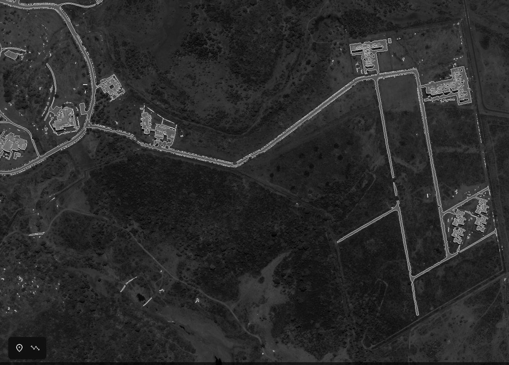

# Road-Network-Extraction
We have performed Road-Network-Extraction using classical Image processing and few libraries.

## PRE 
We performed here various methods and steps and experimented a bit after reading various research paper.
We have stored the part we liked, it includes loading the image and applying unsharp making via gaussian filter and then we performed canny edge detection.

## Road-Network-Extraction-final- 
Here is the final project which include steps as -

* Reading the image 
* Image segmentation via K-means clustering 
* Coverting image to grayscale image 
* Thresholding using epsilon-neighbourhood 
* Detect edges using laplacian-gradient method 
* Overlay edge and original image

## Example Usage

* Install required libraries
  * ``` Opencv ```
  * ``` Matplotlib ```
  * ``` Numpy ```
  * ``` Sklearn ```

* Clone Repo
  
    ``` https://github.com/abhaykes1/Road-Network-Extraction.git ```

* Change working directory

    ``` cd Road-Network-Extraction ```

* Run main file

    ``` python3 Main.py ```

## Outputs

### Input image


### Segmentation using k-means


### epsilon neighbourhood thresholding 


### Road extracted



